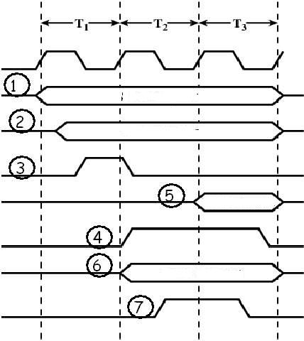

# BUS

1. **Yang menjadi tempat untuk menampung alamat device yang akan dikontrol
adalah:**

I/O AR

2. **Yang menjadi tempat untuk menampung data yang dipertukarkan antara device
dengan CPU adalah:**

I/O BR

3. **Bila data yang dipertukarkan antara memori utama dengan modul I/O tidak
menggunakan fungsi CPU pada pengaturannya, biasanya mengunakan teknik:**

DMA

4. **Sinyal instruksi yang digunakan CPU pada memori utama saat mengirim
informasi alamat dan data adalah:**

- Read
- Write

5. **Sinyal yang digunakan modul I/O saat berkomunikasi dengan CPU adalah:**

Benar semua # TODO

6. **Dari sisi komputer I/O diperlakukan seperti:**

Memory

7. **Yang dilakukan saat I/O berfungsi sebagai output:**

- Terima data dari komputer
- Kirim data ke peripheral

8. **Yang dilakukan saat I/O berfungsi sebagai input:**

- Terima data dari peripheral
- Kirim data ke komputer

9. **Saluran komunikasi yang menghubungkan dua device atau lebih disebut:**

- Bus
- Sistem bus
- Bus system

10. **Pada saat peripheral sedang membaca data, bus yang digunakan:**

Bisa lebih dari satu

11. **Bus terbagi ke dalam beberapa bagian yang disebut:**

- Channel
- Jalur

12. **Struktur bus terbagi menjadi berapa bagian? (Jawab dengan angka)**

3

13. **Yang berfungsi membawa data dan instruksi antar bagian utama komputer
adalah:**

Bus data

14. **Makin lebar bus data maka performansi semakin:**

Meningkat

15. **Bila diasumsikan lebar bus sebesar 8 bit, pada arsitektur MIPS, berapa
kali data diambil? (Jawab dengan angka)**

4

16. **Yang berfungsi mengidentifikasi asal atau tujuan data antar bagian utama
komputer adalah:**

Bus alamat

17. **Yang berfungsi mengatur pengaksesan dan penggunaan jalur data dan alamat
antar bagian utama komputer adalah:**

Bus kontrol

18. **Sinyal status bahwa bus boleh digunakan adalah:**

Bus grant

19. **Kelemahan dari single bus adalah dapat terjadi:**

- Propagation delay
- Bottleneck

20. **Tipe bus yang paling banyak digunakan adalah:**

Dedicated bus

21. **Dapat meningkatkan throughput bila menggunakan tipe bus:**

Physical dedication bus

22. **Bus Controller atau Arbiter digunakan pada tipe bus:**

Terpusat

23. **Setiap modul dapat mengakses bus berdasarkan control logic pada setiap
modul, merupakan tipe bus:**

Distributed

24. **Pada synchronous bus, pengaturan event pada bus menggunakan referensi
dari:**

Clock

25. **Permasalahan pada timing bisa terjadi karena:**

Time gap

26. **Sinkronisasi pada event umumnya dilakukan pada:**

Awal clock

27. **Pada gambar di atas, event sinyal status direpresentasikan oleh nomor:**

1

28. **Pada gambar di atas, event sinyal alamat direpresentasikan oleh nomor:**

2 dan 3

29. **Pada gambar di atas, event sinyal pembacaan data dari main memory
direpresentasikan oleh nomor:**

4 dan 5

30. **Pada gambar di atas, event sinyal penulisan data ke main memory
direpresentasikan oleh nomor:**

6 dan 7

31. **Pada asynchronous bus, pengaturan event pada bus menggunakan referensi
dari:**

- Event
- Kejadian
- Event lain
- Kejadian lain

32. **Lebih fleksibel karena device model lama dapat digunakan bersama-sama
dengan device berkecepatan lebih tinggi, merupakan kelebihan dari:**

Asynchronous bus

33. **Gambar di atas merepresentasikan:**

Read data (multiplexed)

34. **Gambar di atas merepresentasikan:**

Read data (dedicated)

35. **Gambar di atas merepresentasikan:**

Read-modify-write

36. **Gambar di atas merepresentasikan:**

Read-after-write

37. **Gambar di atas merepresentasikan:**

Block data transfer

38. **PCI singkatan dari:**

Peripheral Component Interconnection

39. **Arsitektur PCI bus menggunakan model berikut, kecuali:**

- Distributed arbitration
- Asynchronous timing

40. **Elemen pin wajib pada PCI bus adalah berikut ini, kecuali:**

Pin Interrupt

41. **Pin yang digunakan untuk mengatur timing transaksi pada PCI bus adalah:**

Pin Interface Control

42. **Pin yang digunakan untuk melakukan koordinasi antara initiator dan target
adalah:**

Pin Interface Control

43. **JTAG/Boundary Scan pada PCI bus berfungsi untuk:**

Melakukan prosedur testing
