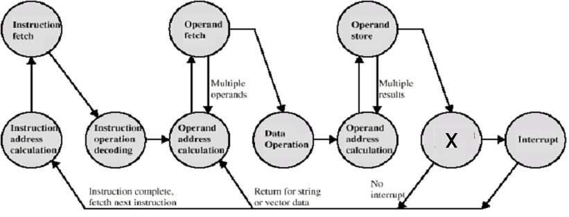

# Input/Output

**Berikut ini merupakan alasan dari adanya modul input output, kecuali:**

- Ukuran data yang ditransfer dalam satu saat berbeda
- Kecepatan transfer berbeda untuk tiap modul
- Format data berbeda

**Device eksternal yang terhubung ke modul I/O disebut:**

- Peripheral

**Yang merupakan jenis-jenis device eksternal adalah:**

- Human readable
- Machine readable
- Communication

**Screen, printer, keyboard, merupakan jenis device:**

Human readable

**Sensor, aktuator, merupakan jenis device:**

Machine readable

**Untuk mengirimkan status dari device (ready atau error),
I/O menggunakan sinyal:**

Status

**Untuk menampung data dari/ke modul I/O sementara waktu digunakan:**

Buffer

**Untuk menentukan aktifitas dan status device eksternal digunakan:**

Control logic

**Untuk mengubah bentuk data dari signal elektrik, mekanik, temperatur,
tekanan, dll menjadi data digital dan sebaliknya digunakan:**

Transducer

**Untuk menentukan apa yang harus dilakukan oleh device,
I/O menggunakan sinyal:**

Kontrol

**Berikut ini merupakan fungsi dari modul I/O:**

- Control
- Timing
- CPU Communication
- Data Buffering
- Error Detection

**Modul I/O berfungsi sebagai pengatur aliran data antara resource internal
(CPU, memori) dengan device eksternal. Merupakan fungsi I/O sebagai:**

Control & Timing

**Modul I/O berfungsi sebagai media komunikasi dari CPU menuju
device eksternal. Merupakan fungsi I/O sebagai:**

CPU Communication

**Modul I/O berfungsi sebagai media komunikasi dari device eksternal menuju
CPU. Merupakan fungsi I/O sebagai:**

Device Communication

**Modul I/O berfungsi sebagai penampung data sementara baik dari CPU/memori
maupun dari peripheral. Merupakan fungsi I/O sebagai:**

Data Buffering

**Modul I/O berfungsi sebagai pendeteksi kesalahan yang ditimbulkan oleh
device. Merupakan fungsi I/O sebagai:**

Error Detection

**Jika status ready, CPU minta agar device mengirimkan data.
Merupakan langkah nomor berapa dari prosedur transfer data dari device
ke CPU via I/O? (Jawab dengan angka)**

3

**Men-decode alamat yang dikirimkan oleh CPU istilahnya disebut:**

Address recognition

**Men-decode perintah/command dari CPU merupakan hal yang dilakukan modul I/O
tatkala berfungsi sebagai:**

CPU Communication

**Meneruskan perintah/command dari CPU ke device merupakan hal yang dilakukan
modul I/O tatkala berfungsi sebagai:**

Device Communication

**Bit parity biasanya digunakan untuk:**

- Error detection
- Metode deteksi
- Metode deteksi error
- Metode deteksi kesalahan

**Mekanisme untuk menghentikan sementara waktu urutan eksekusi program
yang normal tatkala ada program lain yang lebih mendesak
untuk dieksekusi disebut:**

Interrupt

**Yang menjadi penyebab terjadinya interrupt diantaranya adalah:**

- Program
- Timer
- I/O
- Hardware failure

**Interrupt yang disebabkan adanya overflow merupakan jenis interrupt
yang disebabkan:**

Program

**Interrupt yang disebabkan adanya division by zero merupakan jenis interrupt
yang disebabkan:**

Program

**Pre-emptive multi-tasking biasanya menggunakan interrupt
yang disebabkan oleh:**

Timer

**Interrupt yang dihasilkan oleh I/O akibat adanya kesalahan merupakan
jenis interrupt yang disebabkan oleh:**

I/O

**Interrupt yang disebabkan adanya memory parity error merupakan
jenis interrupt yang disebabkan:**

Hardware failure

**Tanda \"X\" pada siklus yang digambarkan oleh state diagram merupakan:**

Interrupt check

**Pada saat terjadi interrupt, maka alamat pada PC diganti menjadi:**

Alamat awal routine interrupt handler

**Kapan dapat terjadi kondisi: CPU mengalami waktu tunggu**

Long I/O Wait

**Mana yang lebih menguntungkan untuk implementasi interrupt?**

Short I/O Wait

**Multiple interrupt diatasi dengan cara:**

> Isi bagian ini.

**Eksekusi I/O terus menerus melibatkan prosesor, merupakan teknik I/O untuk:**

Programmed I/O

**Eksekusi I/O tidak secara terus menerus melibatkan prosesor,
merupakan teknik I/O untuk:**

Interrupt driven I/O

**Transfer data ditangani oleh sebuah prosesor I/O khusus, merupakan teknik
I/O untuk:**

Direct Memory Access (DMA)

**Pada programmed I/O, apa yang dilakukan CPU tatkala operasi I/O
belum selesai?**

CPU tidak melakukan apa-apa

**Memori dan I/O menggunakan ruang alamat yang sama secara bersama-sama
merupakan jenis pengalamatan I/O:**

Memory mapped I/O

**Teknik Identifikasi Interrupt menggunakan software poll mengakibatkan
kelemahan berupa:**

Lambat, karena harus memeriksa modul I/O satu persatu

**Vector digunakan sebagai pointer untuk menunjuk langsung ke device sumber
interrupt sebelum menjalankan interrupt handler pada hardware poll disebut:**

Vectored interrupt
